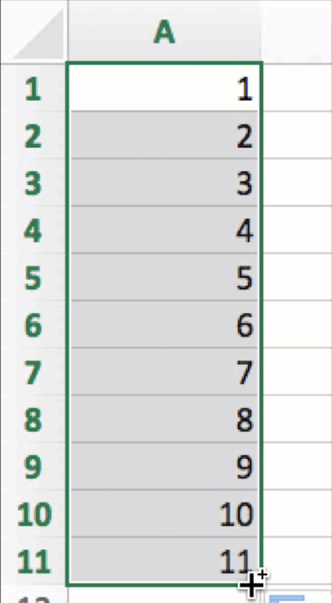

# Publishing with Bookdown {#chapter1}
<!-- TODO: ADD LINK TO View the source code for this page on the GitHub repo to see the underlying code used for our Style Guide. -->

Our broad goal is to create one efficient workflow to produce three versions of the book: HTML pages; PDF/MS Word; AsciiDoc.

1. As co-authors, we composed the book manuscript as a set of R-flavored Markdown files (.Rmd) for each chapter, and use Bookdown to build as a set of HTML pages. We upload the files to our [GitHub repository](https://github.com/handsondataviz) and publish open-access web edition at https://HandsOnDataViz.
2. We also use Bookdown to build the book as a PDF file and as a MS Word file, and upload these to the `docs` folder of our GitHub repository, which our editor may download to comment on the manuscript as we revise.
3. We also have the option to use Bookdown to build one large Markdown file (.md), and use [Pandoc](https://pandoc.org/try/) to convert it into one large AsciiDoc file (.asciidoc), for easier importing into the [O'Reilly Atlas platform](https://docs.atlas.oreilly.com/writing_in_asciidoc.html) if desired.

## File Organization and Headers {- #file-organization}
We organized our [book repository](http://github.com/handsondataviz/book) as a set of .Rmd files, one for each chapter. As co-authors, we are careful to work on different chapters of the book, and to regularly push our commits to the repo. Only one of us builds the book to avoid code merge conflicts.

Bookdown assigns a default ID to each header, which can be used for cross-references. The default label for `# Introduction` is `{#introduction}`, and the default label for `## Part One` is `{#part-one}`, where spaces are replaced by dashes. But we do *not* rely on default IDs because they might change due to editing or contain duplicates across the book.

Instead, we *manually assign a unique ID* to each first- and second-level header in the following way. Note that the `{-}` symbol, used alone or in combination *with a space* and a unique ID, prevents auto-numbering in the second- thru fourth-level headers:

```
# Top-level chapter title {#unique-name}
## Second-level section title {- #unique-name}
### Third-level subhead {-}
#### Fourth-level subhead {-}
```

Also, we match the unique ID keyword to the file name for top-level chapters this way: `08-embed.Rmd`. Unique names should contain only _alphanumeric_ characters (a-z, A-Z, 0-9) or dashes (-).

In the Bookdown `index.Rmd` for the GitBook-style HTML book output and the PDF output, the `toc_depth: 2` setting displays chapter and section headers down to the second level in the Table of Contents.

The `split_by: section` setting divides web pages at the second-level header, which creates shorter web pages with reduced scrolling for readers. For each web page, the unique ID becomes the file name, and is stored in the `docs` subfolder.

The `number_sections` setting is true for the HTML and PDF editions, and given the `toc_depth: 2`, this means that they will display two-level chapter-section numbering (1.1, 1.2, etc.) in the Table of Contents. Note that `number_sections` must be true to display Figure and Table numbers in x.x format, which is desired for this book. See the following excerpt for relevant settings in `index.Rmd`:

```
output:
  bookdown::gitbook:
    dev: svglite
    css: css/style.css
    includes:
      in_header: [custom-scripts.html]
    toc_depth: 2
    split_by: section
    number_sections: true
    split_bib: true

... (continued)

bookdown::pdf_book:
  toc_depth: 2
  number_sections: true
```

Note that chapter and section numbering do *not* appear automatically in the MS Word output unless you supply a reference.docx file:

- https://bookdown.org/yihui/rmarkdown/word-document.html
- https://stackoverflow.com/questions/52924766/numbering-and-referring-sections-in-bookdown
- https://stackoverflow.com/questions/50609212/caption-styles-for-word-document2-in-bookdown

In the `_bookdown.yml` settings, all book outputs are built into the `docs` subfolder of our GitHub repo:
```
output_dir: "docs"
book_filename: "bookdown-testing"
language:
  label:
    fig: "Figure "
chapter_name: "Chapter "
```

In our GitHub repo, we set GitHub Pages to publish to the web using `master/docs`, which means that visitors can browse the source files at the root level, and view the HTML web pages hosted in the `docs` subfolder. We use the GitHub Pages custom domain setting so that the HTML edition is available at https://HandsOnDataViz.org.

## Style Guide {- #style-guide}
Since Bookdown is an R package, we composed the book in R-flavored Markdown (.Rmd).

Each paragraph begins on a separate line. O'Reilly style guide prefers *italics* rather than bold. Use single back tics to display a monospaced `code` word.

Insert an embedded link to [O'Reilly](https://www.oreilly.com/). This appears as a colored clickable link in HTML and Word editions, and a non-colored but clickable link in the PDF edition. According to O'Reilly Atlas documentation, the AsciiDoc version should automatically unfurl for the printed edition.

For lists, always insert a blank line *before* the items, unless they appear directly after hashtag header.

- unordered
- list

1. ordered
2. list

Insert `TODO` to note items to finish or review with co-author or editor.

Insert three back tics to insert a code block. Check character line length limits in [O'Reilly style guide](http://oreillymedia.github.io/production-resources/styleguide/#line-length):

```
<link rel="stylesheet" href="https://unpkg.com/leaflet@1.6.0/dist/leaflet.css" />
<script src="https://unpkg.com/leaflet@1.6.0/dist/leaflet.js"></script>
```

### Conditional Formatting {-}
Conditional formatting offers the option to display text or images in some editions, but not other editions.

To show/hide a few lines of text, insert an HTML code comment `<!-- Comment -->` in the .Rmd file, which also appears as commented-out text in the HTML and .md formats, not visible in the HTML browser, and does not appear in any way in the PDF, MS Word or AsciiDoc formats.

Demo:

<!-- This comment is visible in the source text, but not visible in the HTML or PDF or MSWord or AsciiDoc outputs. -->

Also, the R package function `is_[html/latex]_output` allows conditional output for different book products, such as text that should appear in the HTML edition but not the PDF edition, or vice versa.

Demos:

`r if (knitr::is_html_output()) '<!--'`
This line appears in the PDF and Word versions, and is commented-out in the HTML and Markdown and AsciiDoc versions.
`r if (knitr::is_html_output()) '-->'`

`r if (knitr::is_latex_output()) '<!--'`
This line appears in the HTML, Word, Markdown, and AsciiDoc versions, and is commented-out in the PDF version.
`r if (knitr::is_latex_output()) '-->'`

TODO: Explore and add conditional formatting that displays *only* in the HTML edition, and includes R code-chunks to conditionally display images. See more complex conditional formatting ideas:

- https://stackoverflow.com/questions/56808355/how-to-conditionally-process-sections-in-rmarkdown
- https://bookdown.org/yihui/rmarkdown-cookbook/latex-html.html
- https://blog.earo.me/2019/10/26/reduce-frictions-rmd/
- https://stackoverflow.com/questions/53861244/html-specific-section-in-bookdown
- https://stackoverflow.com/questions/41084020/add-a-html-block-above-each-chapter-header
- https://stackoverflow.com/questions/45360998/code-folding-in-bookdown

### Cross-references {-}
In order to cross-reference in Bookdown, assign a unique name or R code-chunk label to each chapter, section, figure, and table. Unique names and labels should contain only _alphanumeric_ characters (a-z, A-Z, 0-9) or dashes (-).

To cross-reference any *chapter or section*, and allow readers to jump there, use a HTML link with the unique name, such as `chapter2.html` or `style-guide.html`. Demos:

- See ["Style Guide" in Chapter 1](style-guide.html).
- See [Chapter 2](chapter2.html)

Contrary to the [Bookdown manual](https://bookdown.org/yihui/bookdown/cross-references.html), *avoid* using Bookdown unique ID links to cross-reference chapters or sections, because these create extraneous and imprecise URLs, such as this example: [Chapter 1 "Style Guide"](#style-guide)

To cross-reference figures and tables, and display their auto-number and allow readers to jump there, write a call-out with a Bookdown reference to a code-chunk label, such as `See Figure \@ref(fig:sample-map)` or `See Table \@ref(tab:left-table)`. Demos:

- See Figure \@ref(fig:tiger).
- See Table \@ref(tab:left-table).

Cross-reference interactivity varies by output:

- In HTML, all cross-refs are clickable.
- In PDF, all cross-refs are clickable (except chapter-level HTML links).
- In Word, no cross-refs are clickable (unless this varies with reference.docx).
- TBA with Markdown (.md) and AsciiDoc.

When writing cross-references in the text, the [O'Reilly Style Guide](http://oreillymedia.github.io/production-resources/styleguide/#considering_electronic_formats) prefers live cross references (e.g., "see Figure 2-1"), but if not feasible, use "preceding" or "following" because physical placement of elements may vary across print and digital formats. *Avoid* using "above" or "below."

### Images {-}
Create high-resolution color images that will appear in grayscale in print book. Organize static .jpg and .png files, and animated .gif files, into the `images` subfolder by chapter. Write file names in lowercase with dashes (not spaces) and begin with keyword of relevant section to keep related images grouped together. Despite being in separate folders, avoid duplicate image file names across the book. Avoid numbering images since they may not match the final sequence. When appropriate, make two image versions (with and without additional text or art) and add "raw" to the latter file name. Examples:

```
images/05-chart/design-no-junk.png
images/05-chart/design-no-junk-raw.png
```

In this book, only use Markdown formatting for images that appear inside tables and do *not* require captions or figure numbering, and leave the caption field blank:

| Co-Authors      | About Us      |
| --------------- | ------------- |
|  | [Jack Dougherty](http://jackdougherty.org) |
|  | [Ilya Ilyankou](https://github.com/ilyankou) |   


Although Markdown formatting offers a simple syntax that easily converts into other formats with Bookdown/Pandoc, there is no auto-numbering in the HTML edition, while auto-numbering appears in the PDF edition, and numbered figures are required by the publisher. Furthermore, Markdown formatting does not allow conditional output.

For these reasons, this book primarily uses R code-chunk formatting for images. The syntax is more complex but supports auto-numbering in HTML and PDF, and conditional output for interactive and static images. Note that R code-chunk images do *not* easily convert with Pandoc from Markdown to AsciiDoc, but "Figure x Caption" appears as a placeholder.

Auto-numbering appears in `Figure x.x` format in HTML and PDF, but `Figure x` format in MS Word. TODO: Check if Word formatting can be changed with reference.docx.

Note that images in PDF output will "float" by design and may appear before or after the desired page, so always add a cross-reference call-out.

Write R code-chunk labels that follow the image file name, and avoid duplicate labels across the book:

```
ref:design-no-junk

images/05-chart/design-no-junk.png
```

#### Demo: R code-chunk for static image {-}
...as shown in Figure \@ref(fig:tiger).

(ref:tiger) Caption here. Markdown embedded links are acceptable.

```{r tiger, fig.cap="(ref:tiger)"}
 knitr::include_graphics("images/tiger.png")
```

R code-chunks allow more complex conditional formatting, where an interactive map or animated GIF or YouTube video clip appears in the web version, and a static image with an embedded link appears in the PDF and MS Word outputs. Also note the option to change the default iframe height (400px) and width with settings in the `custom-scripts.html` file, with a code comment reminder.

#### Demo: R code-chunk for HTML iframe and static image {-}
...as shown in Figure \@ref(fig:sample-map).

(ref:sample-map) Caption here, and add embedded link to explore the [full-screen interactive map](https://handsondataviz.github.io/leaflet-maps-with-google-sheets/).

<!-- set iframe 600px height 100% width in custom-scripts.html -->
```{r sample-map, fig.cap="(ref:sample-map)"}
if(knitr::is_html_output()) knitr::include_url("https://handsondataviz.github.io/leaflet-maps-with-google-sheets/") else knitr::include_graphics("images/sample-map.jpg")
```

#### Demo: R code-chunk for GIF animation and static image {-}
...as shown in Figure \@ref(fig:excel-drag).

(ref:excel-drag) Caption here, with embedded link to [animated GIF](https://handsondataviz.org/images/02-spreadsheet/excel-drag-consec.gif).

<!-- set iframe 450px height 50% width in custom-scripts.html -->
```{r excel-drag, fig.cap="(ref:excel-drag)"}
if(knitr::is_html_output()) knitr::include_url("https://handsondataviz.org/images/02-spreadsheet/excel-drag-consec.gif") else 
```


TODO: Test conditional formatting with GIF in HTML and static image elsewhere.

TODO: Decide conditional formatting for YouTube video

TODO: Test output size across editions

TODO: Test quality of PDF images with adding R global option setting

TODO: Describe R global option settings in `index.Rmd` to display each R code-chunk without a code echo

```
{r setup, include=FALSE}
knitr::opts_chunk$set(echo = FALSE)
```

### Tables {-}
Create tables in Markdown format, since it produces good output for HTML, PDF, Word, and Markdown. Use a tool such as [Tables Generator](https://www.tablesgenerator.com/markdown_tables) to import significant table data in CSV format, format the column alignment as desired, and press Generate button to create table in Markdown format. For significant table data, save the CSV version in a GitHub repo for potential later use.

Add the Markdown table code shown below to auto-number (Table x) in HTML, PDF, Word.

Table: (\#tab:left-table) Left-justify content, remember blank Line

| Much Much Longer Header | Short Header | Short Header |
|:---------|:---|:---|
| Left-justify text content with left-colons | Less  | Here |
| Use more hyphens to grant more space to some columns | Less | Here |

Table: (\#tab:right-table) Right-justify content, remember blank line

| Header1 | Header2 | Header3 |
|-----:|-----:|-----:|
| 123 | 456 | 789 |
| Right-justify | numerical content  | with right-colons |
| Use equal hyphens | to make equal space | for all columns |

Workaround: Currently, our attempt to use Pandoc to directly convert a Bookdown-generated Markdown file to AsciiDoc fails because Bookdown creates the .md file with tables in .html format, not Markdown. One workaround is to paste the individual Markdown-formatted tables directly from the .Rmd into the large .md file prior to converting with Pandoc to AsciiDoc.

### Bibliographic references {-}
TODO: Set up Zotero to use Chicago-style footnotes (check O'Reilly style guide)

### Pandoc Conversion {-}
- Download [Pandoc](https://pandoc.org)
- TODO: Ask Ilya about my Pandoc PATH and/or overwriting older version
- Set Bookdown to build the book as one large Markdown file (docs folder, suffix .md)
- Use command line to navigate to subfolder with `pwd` and `cd`.
- Convert with: `pandoc bookdown-testing.md --from markdown --to asciidoc --standalone --output bookdown-testing-modified.asciidoc`
- Confirm if AsciiDoc file matches [O'Reilly Atlas import style](https://docs.atlas.oreilly.com/writing_in_asciidoc.html).
