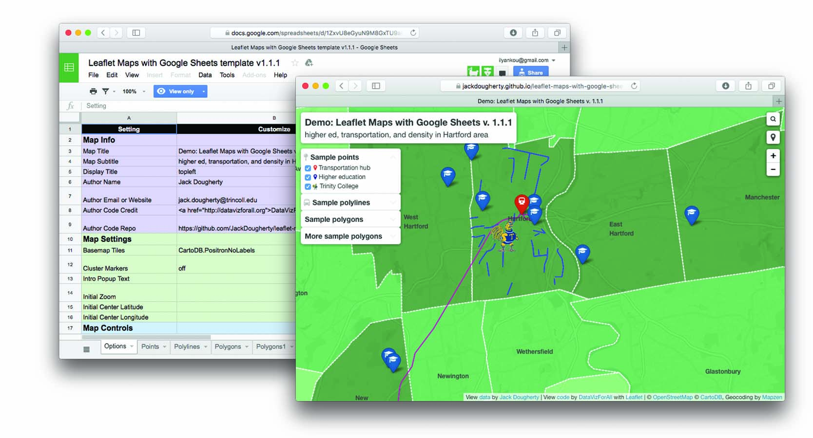

## Style Guide {#style-guide}

### File organization {-}
We organized our [book repository](http://github.com/handsondataviz/book) as a set of individual .Rmd files, one for each chapter and each section. Chapter files are named 01-topic, 02-topic, etc., and section files are named 01.1-subtopic, 01.2-subtopic, etc. The non-numbered portion of the file name also serves as the unique name in the chapter/section header: `{#unique-name}`. This file structure gives us co-authors maximum flexibility to add and edit different sections of the book at the same time.

Our current Bookdown `index.Rmd` settings auto-number each chapter and section in the table of contents. Alternatively, we could set auto-numbering to false, and manually number of title of each chapter only.   

```
output:
  bookdown::gitbook:
    dev: svglite
    css: css/style.css
    toc_depth: 2
    split_by: section
    number_sections: true
    split_bib: true
```

### Headers {-}

- top-level chapter title (A) = 1 hashtag followed by `{#unique-name}`
- second-level section title (B) = 2 hashtags followed by `{#unique-name}`
- third-level header (C) = 3 hashtags followed by `{-}` to avoid auto-number
- fourth-level header (D) = 4 hashtags followed by `{-}` to avoid auto-number

Each paragraph begins on a separate line. O'Reilly style guide prefers *italics* rather than bold. Use single back tics to display a monospaced `code` word.

Insert an embedded link to [O'Reilly](https://www.oreilly.com/). This appears as a colored clickable link in HTML and Word editions, and a non-colored but clickable link in the PDF edition. According to O'Reilly Atlas documentation, the AsciiDoc version should automatically unfurl for the printed edition.

Lists: always insert a blank line before items, unless directly after hashtag header.

- unordered
- list

1. ordered
2. list

Insert three back tics to insert a code block. Check character line length limits in [O'Reilly style guide](http://oreillymedia.github.io/production-resources/styleguide/#line-length):

```
<link rel="stylesheet" href="https://unpkg.com/leaflet@1.6.0/dist/leaflet.css" />
<script src="https://unpkg.com/leaflet@1.6.0/dist/leaflet.js"></script>
```

### Cross-references {-}
For Bookdown cross-references, assign a unique name to each chapter, section, figure, and table. Make sure the unique name (aka R code-chunk label) only contains _alphanumeric_ characters (a-z, A-Z, 0-9), slashes (/), or dashes (-).

- In HTML, all cross-refs are clickable and auto-numbered (except to chapter).
- In PDF, all cross-refs (except chapter) are clickable and auto-numbered.
- In Word, all cross-refs are auto-numbered (except chapter), but none are clickable.
- TBA with AsciiDoc.

Demos:

- To another *chapter*, use HTML link: See [chapter 2](chapter2.html).
- To another *section*, use Bookdown ID ref: See section \@ref(style-guide).
- To figure in any chapter/section, use Bookdown ID ref: Figure \@ref(fig:sample-interactive-map), or Figure \@ref(fig:sample-static-image2).
- To table in any chapter/section, use Bookdown ID ref: Table \@ref(tab:unique1).

[O'Reilly Style Guide](http://oreillymedia.github.io/production-resources/styleguide/#considering_electronic_formats): Using live cross references (e.g., "see Figure 2-1") is best, but when that’s not possible, use "preceding" or "following," as the physical placement of elements could be different in reflowable formats. *Avoid* using "above" or "below." See also http://oreillymedia.github.io/production-resources/styleguide/#cross_references

### Conditional Formatting {-}
Conditional formatting offers the option to display text or images in some editions, but not other editions.

Demo: Simple HTML code comment in .Rmd file (appears as commented-out text in HTML and .md, but does *not* appear in any way in PDF or MS Word or AsciiDoc):

<!-- Insert comments that are visible in the source text (.Rmd and .md), but not HTML or PDF or AsciiDoc. -->

The R package function `is_[html/latex]_output` allows authors to produce conditional output for different book products, such as text that should appear in the HTML edition but not the PDF edition, or vice versa.

Demos:

`r if (knitr::is_html_output()) '<!--'`
This line appears in the PDF and Word versions, and is commented-out in the HTML and Markdown and AsciiDoc versions.
`r if (knitr::is_html_output()) '-->'`

`r if (knitr::is_latex_output()) '<!--'`
This line appears in the HTML, Word, Markdown, and AsciiDoc versions, and is commented-out in the PDF version.
`r if (knitr::is_latex_output()) '-->'`

See more complex syntax for conditional formatting at:

- https://stackoverflow.com/questions/56808355/how-to-conditionally-process-sections-in-rmarkdown
- https://bookdown.org/yihui/rmarkdown-cookbook/latex-html.html
- https://blog.earo.me/2019/10/26/reduce-frictions-rmd/
- https://stackoverflow.com/questions/53861244/html-specific-section-in-bookdown  This hack no longer works, and was only a partial solution
- https://stackoverflow.com/questions/41084020/add-a-html-block-above-each-chapter-header
- https://stackoverflow.com/questions/45360998/code-folding-in-bookdown

### Images {-}
TODO: Decide pros and cons of two methods, and probably use one method consistently (unless there's a strong reason for hybrid usage). Note that auto-numbering may be a problem if we display different images for HTML versus O'Reilly products

1. Markdown formatting
   - Simple syntax
   - Converts easily with Pandoc into AsciiDoc format
   - No auto-numbering in HTML or Word editions
   - Auto-numbering in PDF edition
   - TODO: Can this be compatible with R code-chunk conditional formatting to make certain images appear only in HTML edition?
2. R code-chunk formatting:
   - More complex syntax
   - Handles conditional formatting to insert iframe into HMTL edition and static image for Word/PDF editions
   - Image does *not* convert to AsciiDoc format, but caption and static number (Figure x) appears as placeholder.
   - Figures are auto-numbered, but varies by format: Figure x.x in HTML, PDF, but Figure x in Word; static Figure x in AsciiDoc.

#### Markdown demo for static image {-}


#### R code-chunk demo for static image {-}
(ref:sample-static-image) Caption for sample static image using R code-chunk method. Auto-numbered as Figure x.x in HMTL and PDF, but as Figure x in Word. Note that image in PDF edition may "float" and appear before or after page, so needs cross-reference.

```{r sample-static-image, fig.cap="(ref:sample-static-image)"}
 
```

#### R code-chunk demo for sample interactive HTML iframe and static image {-}
(ref:sample-interactive-map) Insert caption here, with embedded link to explore the [full-screen interactive map](https://handsondataviz.github.io/leaflet-maps-with-google-sheets/) Auto-numbered as Figure x.x in HTML and PDF, but as Figure x in Word. Note that image in PDF edition may "float" and appear before or after page, so needs cross-reference.

<!-- set iframe 640px height 100% width in custom-scripts.html -->
```{r sample-interactive-map, fig.cap="(ref:sample-interactive-map)"}
if(knitr::is_html_output()) knitr::include_url("https://handsondataviz.github.io/leaflet-maps-with-google-sheets/") else 
```

### Tables {-}
Create tables in Markdown format, since it produces good output for HTML, PDF, Word, and Markdown. Use a tool such as [Tables Generator](https://www.tablesgenerator.com/markdown_tables) to import significant table data in CSV format, format the column alignment as desired, and press Generate button to create table in Markdown format. For significant table data, save the CSV version in a GitHub repo for potential later use.

Add the Markdown table code shown below to auto-number (Table x) in HTML, PDF, Word.

Table: (\#tab:unique1) Left-justify content, remember blank Line

| Much Much Longer Header | Short Header | Short Header |
|:---------|:---|:---|
| Left-justify text content with left-colons | Less  | Here |
| Use more hyphens to grant more space to some columns | Less | Here |

Table: (\#tab:unique2) Right-justify content, remember blank line

| Header1 | Header2 | Header3 |
|-----:|-----:|-----:|
| 123 | 456 | 789 |
| Right-justify | numerical content  | with right-colons |
| Use equal hyphens | to make equal space | for all columns |

Workaround: Currently, our attempt to use Pandoc to directly convert a Bookdown-generated Markdown file to AsciiDoc fails because Bookdown creates the .md file with tables in .html format, not Markdown. One workaround is to paste the individual Markdown-formatted tables directly from the .Rmd into the large .md file prior to converting with Pandoc to AsciiDoc.

### Bibliographic references
TODO: Set up Zotero to use Chicago-style footnotes (check O'Reilly style guide)

### Pandoc Conversion {-}
- Download [Pandoc](https://pandoc.org)
- TODO: Ask Ilya about my Pandoc PATH and/or overwriting older version
- Set Bookdown to build the book as one large Markdown file (docs folder, suffix .md)
- Use command line to navigate to subfolder with `pwd` and `cd`.
- Convert with: `pandoc bookdown-testing.md --from markdown --to asciidoc --standalone --output bookdown-testing-MMDD.asciidoc`
- Confirm if AsciiDoc file matches [O'Reilly Atlas import style](https://docs.atlas.oreilly.com/writing_in_asciidoc.html).
